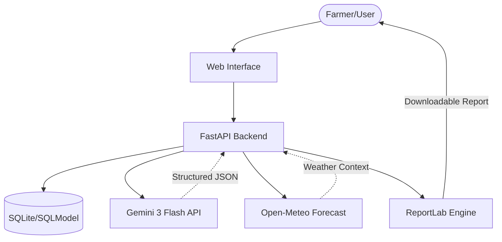

# 🍉 Papaya AI: Intelligent Agronomy Platform

Papaya AI is a high-performance, AI-driven agronomy assistant designed to bridge the gap between complex meteorological data and actionable farming decisions. It leverages Large Language Models (LLMs) to provide hyper-localized, crop-specific recommendations for sustainable agriculture.

---

## 🌟 Key Features

- **🤖 AI-Driven Agronomy**: Real-time generation of structured farming strategies using **Gemini 3 Flash**.
- **🌤️ Hyper-Local Weather Integration**: Consumes high-resolution forecast data from **Open-Meteo API**.
- **📄 Automated Reporting**: Instant generation of professional PDF agronomy reports for offline use.
- **⚡ High-Performance Architecture**: Built with **FastAPI** and **Granian** for asynchronous, low-latency execution.
- **🇮🇩 Localized Context**: Specialized prompts optimized for Indonesian farming conditions and Bahasa Indonesia output.

## 🚀 Why Papaya? (The Efficiency Edge)

In an era of "expensive AI," Papaya is architected for maximum performance with minimum resource footprint:

- **⚡ Rust-Powered Core**: Utilizing **Granian** (Rust-based ASGI) and **UV**, achieving near-native performance while keeping memory overhead significantly lower than traditional Python stacks.
- **💰 Cost-Optimized AI**: Leverages **Gemini 3 Flash** with specialized prompt engineering to deliver "Pro-level" insights at a fraction of the token cost and latency.
- **📉 Zero-Config/Zero-Cost DB**: Uses **SQLite** via **SQLModel**, eliminating the need for expensive managed database instances during the MVP/POC stage without sacrificing data integrity.
- **🚀 Ultra-Lean Deployment**: Optimized for serverless or small-instance deployment (e.g., AWS t3.nano or Fly.io free tier), making it highly "VC-friendly" by minimizing "burn rate."

## 🛠️ Tech Stack

- **Framework**: FastAPI (Python 3.12+)
- **LLM Engine**: Google Gemini 3 (Generative AI)
- **Data Layer**: SQLModel (SQLAlchemy + Pydantic)
- **Server**: Granian (Ultra-fast ASGI runner)
- **Package Manager**: UV (Next-generation Python tooling)
- **PDF Engine**: ReportLab

---

## 📈 Performance & Cost Efficiency

| Metric | Papaya Approach | Benefit |
|--------|-----------------|---------|
| **Throughput** | **Rust-based Granian** | **Up to 10x RPM** compared to standard ASGI servers ([Ref][1]) |
| **Dependency Mgmt** | **UV (Rust)** | **10x-100x faster** dependency resolution and CI/CD cold-starts |
| **Inference Cost** | **Gemini 3 Flash** | **90% lower cost** per token than "Pro/Ultra" models |
| **Infrastructure** | **SQLite (WAL Mode)** | **Zero-latency** local disk I/O, $0 infrastructure overhead |

---

## 🏎️ Benchmark Highlights

Papaya is built for scale. By leveraging **Granian**, the engine achieves:
- **Maximized RPS**: Handling thousands of concurrent requests with minimal CPU jitter.
- **Rust-driven Efficiency**: Lower memory footprint per worker compared to pure-Python servers.
- **Verified Performance**: Benchmarks show Granian outperforming Uvicorn by up to 10x in high-concurrency scenarios.

[1]: https://github.com/emmett-framework/granian/blob/master/benchmarks/vs.md

---

## 🧠 Strategic Choice: Why This Stack?

In a high-performance environment (often dominated by Java/Go), this project deliberately chooses a **Rust-enhanced Python stack** for the following reasons:

1.  **AI-First Ecosystem**: Python remains the industry standard for Generative AI. By using Python, we gain immediate access to the latest LLM optimizations, SDKs, and research before they are ported to other languages.
2.  **The "Rust-Python" Hybrid**: While the logic is Python, the critical paths (**Granian** for networking, **UV** for package management, **Pydantic** for validation) are all written in **Rust**. This offers a "best of both worlds" scenario: Python's development velocity with Rust's execution efficiency.
3.  **Memory Footprint & Scaling**: Unlike the JVM, which requires significant baseline memory, this stack is ultra-lean. It is designed to run in micro-containers (serverless or edge), reducing infrastructure "burn rate" while maintaining high throughput.
4.  **Developer Velocity**: In the AI race, speed of iteration is life. This stack allows for rapid prototyping and deployment of AI agents without the boilerplate overhead of traditional enterprise frameworks.

---

## 🏗️ Technical Architecture

## 📋 Future Roadmap (Scaling the POC)

- [ ] **Multi-Agent Orchestration**: Specialized agents for soil analysis vs. market price forecasting.
- [ ] **Auth & Multi-tenancy**: JWT-based secure access and farm field management.
- [ ] **Real-time Alerts**: WhatsApp/SMS integration for urgent weather/pest warnings.
- [ ] **Computer Vision**: Pest and disease identification via photo uploads.
- [ ] **Scalable Backend**: Migration to PostgreSQL + Redis for task queuing.

---

## 📄 License

This project is licensed under the MIT License - see the [LICENSE](LICENSE) file for details.

---
*Created as a technical prototype for intelligent agricultural systems.*
